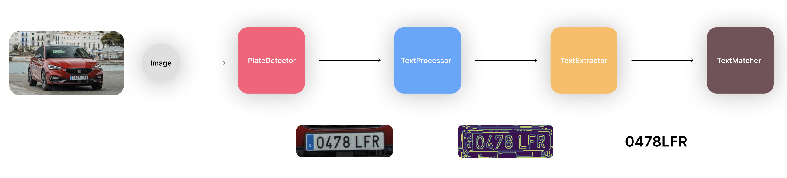

## Práctica 5. Reconocimiento de matrículas

## Introducción

Para la realización de esta tarea hemos definido un pipeline del procesado paso a paso necesario para transformar la imagen de entrada a una lectura de matricula fiable.

El esquema sería el siguiente



Como podemos observar nuestro pipeline esta segmentado en cuatro etapas. Cada una de ellas se ha tratado de forma abstracta con interfaces que en un futuro podrán permitir el cambio de tecnologías y la modularidad del código realizado.

1. PlateDetector: esta sería la etapa dedicada a la detección de las diferentes mátriculas.
2. TextProccesor: esta etapa cogería la imagen resultante de la mátricula y la trataria para que el texto sea mas legible para la siguiente etapa.
3. TextExtractor: esta etapa cogería la matricula ya tratada y extraeria el texto a partir de un OCR.
4. TextMatcher: comprobaría que el resultado de la extracción del texto cumple el formato requerido para ser considerado una mátricula.

## Detección de mátriculas

La interfaz que hemos creado para la detección de mátriculas es la siguiente

```python
class PlateDetector(ABC):
    @abstractmethod
    def detect(self, img: array) -> list[array]:
        pass
```

Como sabemos en python no existen las interfaces por lo tanto lo hemos implementado como una clase abstracta. Esta recive una imagen y devuelve una lista de imagenes puesto que en una foto podría haber varias matriculas.

La implementación que hemos realizado esta interfaz ha sido con Yolov8. Hemos entrenado el modelo con el siguiente dataset para poder detectar mátriculas.

https://universe.roboflow.com/roboflow-universe-projects/license-plate-recognition-rxg4e


```python
class YOLOPlateDetector(PlateDetector):
    def __init__(self, model, category = 0, image_processors = list()):
        self.model = model
        self.category = category
        self.image_processors = image_processors

    def detect(self, img):
        from ultralytics import YOLO
        model = YOLO(self.model)
        results = model(img)
        cars = []
        for x in results:
            boxes = x.boxes
            for box in boxes:
                x1, y1, x2, y2 = box.xyxy[0]
                x1, y1, x2, y2 = int(x1), int(y1), int(x2), int(y2)
                category = int(box.cls[0])
                if category == 0:
                    img = img[y1:y2, x1:x2]
                    for x in self.image_processors:
                        img = x.process(img)
                    cars.append(img)
        return cars
```

### Procesado de la matricula

Esta etapa sería la segunda en nuestro pipeline. Esta encargada deprocesar las diferentes mátriculas con filtros usados en la asignatura como Canny, Threshold etc. de forma que al OCR se le facilite la tarea de detección.

Aunque siendo honestos ha funcionado mejor sin ningún tipo de filtros. Pensabamos que al extraer los bordes nada mas con Canny o aplicar ciertos thresholds para eliminar colores diferentes del blanco y negro funcionaría mejor pero no ha sido así. Es más, ha funcionado incluso peor en varios casos.

Esta sería la interfaz de un procesador de matricula.

```python
class ImageProcessor(ABC):
    @abstractmethod
    def process(self, img: array) -> array:
        pass
```

Como podemos observar recibe una imagen y devuelve otra imagen procesada.

Hemos realizado varias implementaciones de esta interfaz. Una para aplicar Canny, otra para Sobel, otra para Threshold y un intento con FindCountours.

```python
class CannyImageProcessor(ImageProcessor):
    def __init__(self, x, y):
        self.x = x
        self.y = y

    def process(self, img: array) -> array:
        #apply Canny
        import cv2 as cv
        import matplotlib.pyplot as plt
        canny = cv.Canny(img, self.x, self.y)
        plt.imshow(canny)
        plt.show()
        return canny

class SobelImageProcessor(ImageProcessor):
    def __init__(self, x, y):
        self.x = x
        self.y = y

    def process(self, img: array) -> array:
        #apply Sobel
        import cv2 as cv
        import matplotlib.pyplot as plt
        sobel = cv.Sobel(img, cv.CV_8U, self.x, self.y, ksize=5)
        plt.imshow(sobel)
        plt.show()
        return sobel


class ColorThresholdImageProcessor(ImageProcessor):
    def __init__(self, lower, upper):
        self.lower = lower
        self.upper = upper
    
    def process(self, img: array) -> array:
        import cv2 as cv
        import matplotlib.pyplot as plt
        img = cv.cvtColor(img, cv.COLOR_BGR2GRAY)
        #extract only black colors
        mask = cv.inRange(img, self.lower, self.upper)
        img = cv.bitwise_and(img, img, mask=mask)

        plt.imshow(img)
        plt.show()
        return img

class ContoursImageProcessor(ImageProcessor):
    def process(self, image: array) -> array:
        import cv2
        import numpy as np
        import matplotlib.pyplot as plt

        mask = np.ones(image.shape, dtype=np.uint8) * 255
        gray = cv2.cvtColor(image, cv2.COLOR_BGR2GRAY)
        thresh = cv2.threshold(gray, 0, 255, cv2.THRESH_BINARY_INV + cv2.THRESH_OTSU)[1]
        kernel = cv2.getStructuringElement(cv2.MORPH_RECT, (5,5))
        dilate = thresh

        cnts = cv2.findContours(dilate, cv2.RETR_TREE, cv2.CHAIN_APPROX_SIMPLE)
        cnts = cnts[0] if len(cnts) == 2 else cnts[1]
        for c in cnts:
            area = cv2.contourArea(c)
            if area < 300:
                x,y,w,h = cv2.boundingRect(c)
                mask[y:y+h, x:x+w] = image[y:y+h, x:x+w]
        
        plt.imshow(mask)
        plt.show()
        return mask
```

Como podemos observar estos se añaden al detector de mátriculas en forma de lista para poder mezclar varios filtros.

```
plate_detector = YOLOPlateDetector(model='plate_recognizer.pt', image_processors=[
        CannyImageProcessor(0, 100),
        ColorThresholdImageProcessor((0, 0, 0), (120, 120, 120))
    ]
)
```

### Extractor del texto

Por último quedaría coger las imagenes procesadas y extraer el correspondiente texto de ellas.

Para esto hemos creado la siguiente interfaz

```python
class TextExtractor(ABC):
    def __init__(self, matcher : PlateMatcher, processor : TextProcessor):
        self.matcher = matcher
        self.processor = processor

    @abstractmethod
    def extract(self, img: array) -> str:
        pass
```

Y la hemos implementado con EasyOCR, TesseractOCR y KerasOCR, siendo la que mejores resultados a dado EasyOCR.

```python
class TesseractTextExtractor(TextExtractor):
    def extract(self, img):
        import pytesseract
        pytesseract.pytesseract.tesseract_cmd = r'/usr/local/bin/tesseract'
        text = pytesseract.image_to_string(img)
        matcher = RegexPlateMatcher()
        if matcher.match(text):
            text = self.processor.process(text)
            return text
        
class EasyOCRTextExtractor(TextExtractor):
    def extract(self, img):
        import easyocr
        reader = easyocr.Reader(['es']) 
        result = reader.readtext(img)
        if(len(result) == 0): return ""
        for x in result:
            text = x[1]
            text = self.processor.process(text)
            if(self.matcher.match(text)):
                return text

class KerasOCRTextExtractor(TextExtractor):
    def extract(self, img):
        from keras_ocr.detection import Detector
        from keras_ocr.recognition import Recognizer
        from keras_ocr import pipeline

        detector = Detector()
        recognizer = Recognizer()
        pipeline = pipeline.Pipeline(detector=detector, recognizer=recognizer)
        prediction_groups = pipeline.recognize([img])
        for group in prediction_groups:
            for word in group:
                text = word[0]
                text = self.processor.process(text)
                if(self.matcher.match(text)):
                    return text
```


### Identificadores de texto

Los identificadores de texto son usados para saber si el texto detectado por la etapa anterior corresponde al formato buscado. De esta forma podremos descartar detecciones erroneas.

La interfaz usada para este labor es la siguiente

```python
class PlateMatcher(ABC):
    @abstractmethod
    def match(self, text : str) -> bool:
        pass

```

Se han realizado dos implementaciones, una con longitud de texto y otra con regex

```python
class LengthPlateMatcher(PlateMatcher):
    def match(self, text : str) -> bool:
        if len(text) == 7: return True
        return False

class RegexPlateMatcher(PlateMatcher):
    def match(self, text : str) -> bool:
        import re
        pattern = re.compile("^[0-9]{4}([B-D]|[F-H]|[J-N]|[P-T]|[V-Z]){3}$")
        if pattern.match(text):
            return True
        else:
            return False
```


### Mejoras de rendimiento propuestas

Para mejorar el rendimiento se ha probado a implementar multithreading lanzando varios hilos para procesar a la vez multiples iamgenes. El código siguiente ha sido el usado para probar el rendimiento entre una ejecución con normal y otra threads.

Ejecución normal:

```python
text_extractor=EasyOCRTextExtractor(
    processor=BasicTextProcessor(), 
    matcher=LengthPlateMatcher()
)


plate_detector = YOLOPlateDetector(model='plate_recognizer.pt', image_processors=[
    ]
)

detector = CarPlateDetector(
    text_extractor,
    plate_detector
)


def  detectImage():
    result = detector.detect('./plates/coches2.jpg')
    print(result)

for x in range(0, 10):
    detectImage()
```

Ejecución con threads:

```python
import threading 

text_extractor=EasyOCRTextExtractor(
    processor=BasicTextProcessor(), 
    matcher=LengthPlateMatcher()
)

plate_detector = YOLOPlateDetector(model='plate_recognizer.pt')

detector = CarPlateDetector(
    text_extractor,
    plate_detector
)


def  detectImage():
    result = detector.detect('./plates/coches2.jpg')


threads = [
]

def add_threads(num_threads=10):
    for x in range(0, num_threads):
        threads.append(threading.Thread(target=detectImage))
    
def join_threads():
    for x in threads:
        x.start()
    for x in threads:
        x.join()

add_threads(10)
join_threads()

```

Tardando la ejecución normal 2m y 21 segundos con 10 imagenes. Y la ejecución con threads 29 segundos como se puede apreciar en el notebook. Por lo tanto la mejora si que es substancial. Sin embargo para implementar threads en el video sería necesario código que lanzara un thread por frame. Conociendo la cantidad de frames que tiene un video actual esto sería inviable por limitaciones del procesador. Por lo tanto la implementación en el video se ha realizado sin threads.

### Predicciones en video

El código usado para el video ha sido el siguiente:

```python
import cv2

cap = cv2.VideoCapture('videos/license_plates_fps.mp4')
width = int(cap.get(cv2.CAP_PROP_FRAME_WIDTH) / 2)
height = int(cap.get(cv2.CAP_PROP_FRAME_HEIGHT) / 2)

processor = BasicTextProcessor()
# matcher = LengthPlateMatcher()
matcher = RegexPlateMatcher()
detector = YOLOPlateDetector(model='plate_recognizer.pt')
extractor = EasyOCRTextExtractor(matcher, processor)

while True:
    ret, frame = cap.read()
    if not ret: break

    frame = cv2.resize(frame, (width, height))
    plates = detector.detect(frame)

    # Dibujar rectángulos alrededor de las placas detectadas
    for plate in plates:
        if len(plate) == 5:  # Asegurarse de que haya cuatro valores en la tupla
            x1, y1, x2, y2, img = plate
            cv2.rectangle(frame, (x1, y1), (x2, y2), (0, 255, 0), 2)
            detection = extractor.extract(img)
            if detection == None or detection == '': detection = "unknown plate"
            cv2.putText(frame, detection, (x1, y1 - 10), cv2.FONT_HERSHEY_SIMPLEX, 0.5, (0, 255, 0), 2)

    cv2.imshow('Plates', frame)
    if cv2.waitKey(20) == 27: 
        break

cap.release()
cv2.destroyAllWindows()
```

A su vez el video lo hemos grabado nosotros mismos en la calle proporcionando un entorno mas realista que los posibles encontrados en internet.